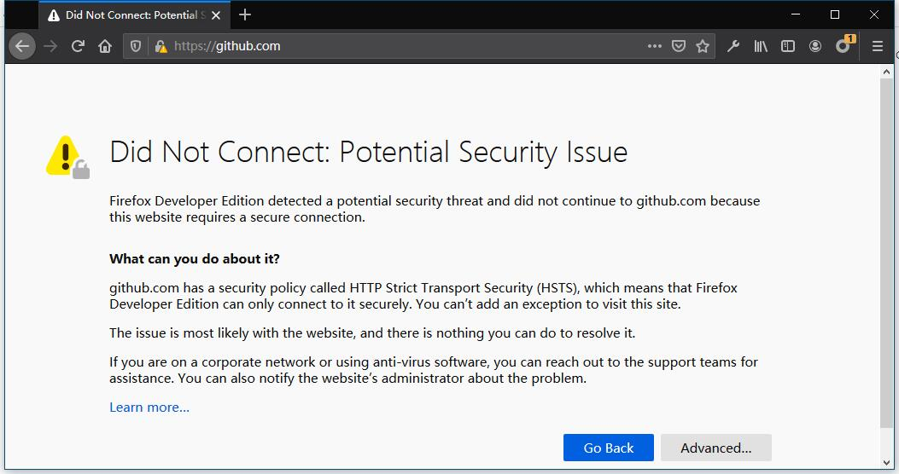
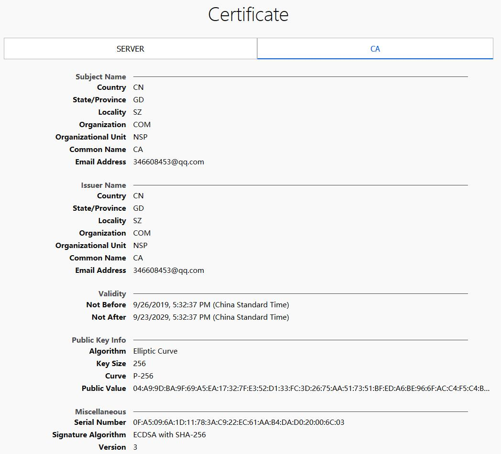
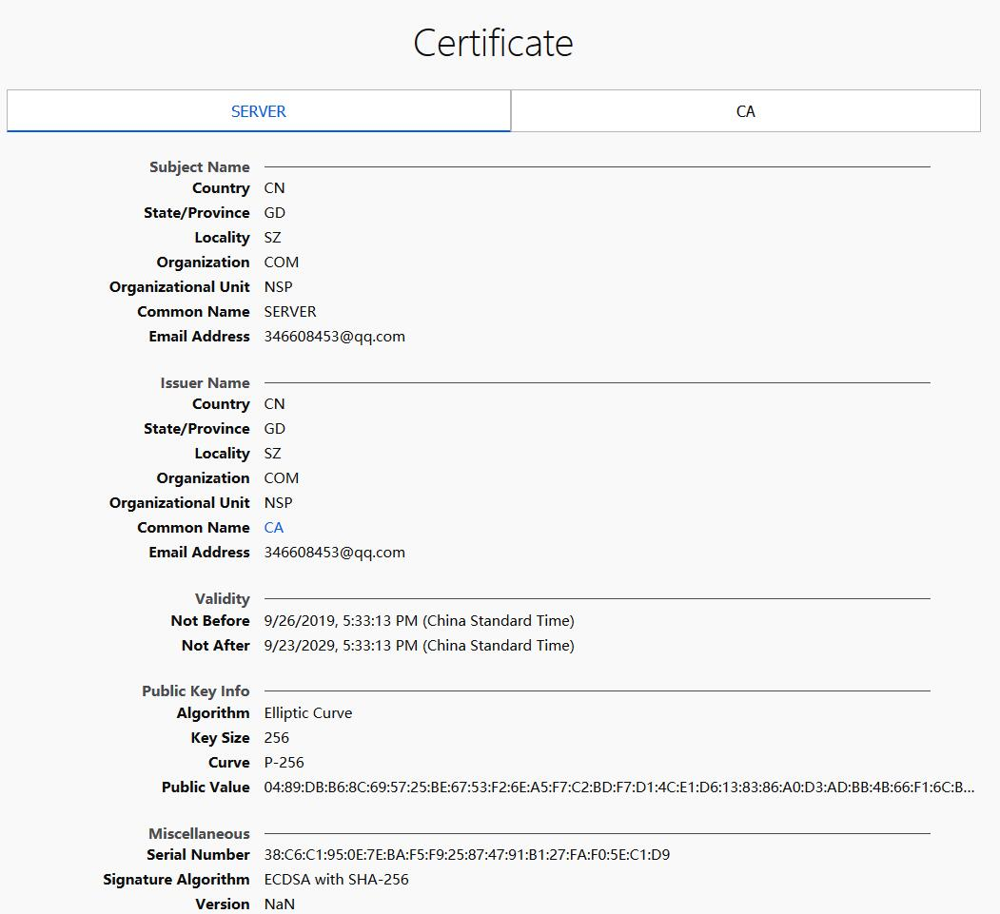

# GitHub 等大面积 HTTPs 劫持


昨天下午两点多，突然在一个站长群里听到有人说 GitHub Pages 的证书大批量出现错误，不一会就在V2EX上看到相关讨论的帖子

当天晚上再次刷V2EX的时候发现部分cloudflare的IP和京东主站部分IP也出现相似的劫持事件

今天早晨8点左右，在V2EX上发现有人讨论 GitHub 主站出现相同的https劫持，不经过代理访问发现证书的确异常



查看证书详情





## 检查GitHub证书

这里我通过北京和香港两台阿里云主机，使用OpenSSL提供的方法查看证书详细内容

命令为: `OpenSSL s_client -showcerts -connect github.com:443 < /dev/null`

### 北京阿里云

<details>
  <summary>点击展开</summary>

```bash
➜  ~ OpenSSL s_client -showcerts -connect github.com:443 < /dev/null
CONNECTED(00000003)
depth=1 C = CN, ST = GD, L = SZ, O = COM, OU = NSP, CN = CA, emailAddress = 346608453@qq.com
verify error:num=19:self signed certificate in certificate chain
verify return:1
depth=1 C = CN, ST = GD, L = SZ, O = COM, OU = NSP, CN = CA, emailAddress = 346608453@qq.com
verify return:1
depth=0 C = CN, ST = GD, L = SZ, O = COM, OU = NSP, CN = SERVER, emailAddress = 346608453@qq.com
verify return:1
---
Certificate chain
 0 s:C = CN, ST = GD, L = SZ, O = COM, OU = NSP, CN = SERVER, emailAddress = 346608453@qq.com
   i:C = CN, ST = GD, L = SZ, O = COM, OU = NSP, CN = CA, emailAddress = 346608453@qq.com
-----BEGIN CERTIFICATE-----
MIIB4TCCAYcCFDjGwZUOfrr1+SWHR5GxJ/rwXsHZMAoGCCqGSM49BAMCMHExCzAJ
BgNVBAYTAkNOMQswCQYDVQQIDAJHRDELMAkGA1UEBwwCU1oxDDAKBgNVBAoMA0NP
TTEMMAoGA1UECwwDTlNQMQswCQYDVQQDDAJDQTEfMB0GCSqGSIb3DQEJARYQMzQ2
NjA4NDUzQHFxLmNvbTAeFw0xOTA5MjYwOTMzMTNaFw0yOTA5MjMwOTMzMTNaMHUx
CzAJBgNVBAYTAkNOMQswCQYDVQQIDAJHRDELMAkGA1UEBwwCU1oxDDAKBgNVBAoM
A0NPTTEMMAoGA1UECwwDTlNQMQ8wDQYDVQQDDAZTRVJWRVIxHzAdBgkqhkiG9w0B
CQEWEDM0NjYwODQ1M0BxcS5jb20wWTATBgcqhkjOPQIBBggqhkjOPQMBBwNCAASJ
27aMaVclvmdT8m6l98K999FM4dYTg4ag0627S2bxbLYHyLdQ0jqay5kA9KCF9Ucw
uzcqtTrNERlLIsxDGkLjMAoGCCqGSM49BAMCA0gAMEUCIH1+jEiQTVA+siP2g9kw
ITFZZINVKyET48788OSCLK1hAiEA+c5bJvnrdtZ1rbsLXJWtglkXSeBaHy5Wdt7w
dGc7McM=
-----END CERTIFICATE-----
 1 s:C = CN, ST = GD, L = SZ, O = COM, OU = NSP, CN = CA, emailAddress = 346608453@qq.com
   i:C = CN, ST = GD, L = SZ, O = COM, OU = NSP, CN = CA, emailAddress = 346608453@qq.com
-----BEGIN CERTIFICATE-----
MIICNzCCAd2gAwIBAgIUD6UJah0ReDrJIuxhqrTa0CAAbAMwCgYIKoZIzj0EAwIw
cTELMAkGA1UEBhMCQ04xCzAJBgNVBAgMAkdEMQswCQYDVQQHDAJTWjEMMAoGA1UE
CgwDQ09NMQwwCgYDVQQLDANOU1AxCzAJBgNVBAMMAkNBMR8wHQYJKoZIhvcNAQkB
FhAzNDY2MDg0NTNAcXEuY29tMB4XDTE5MDkyNjA5MzIzN1oXDTI5MDkyMzA5MzIz
N1owcTELMAkGA1UEBhMCQ04xCzAJBgNVBAgMAkdEMQswCQYDVQQHDAJTWjEMMAoG
A1UECgwDQ09NMQwwCgYDVQQLDANOU1AxCzAJBgNVBAMMAkNBMR8wHQYJKoZIhvcN
AQkBFhAzNDY2MDg0NTNAcXEuY29tMFkwEwYHKoZIzj0CAQYIKoZIzj0DAQcDQgAE
qZ26n2ml6hcyf+NS0TP8PSZ1qlFzUb/tpr6Wb6zE9cSzkGOXej0ddI3sNvq/bLzk
LLvaQLEzaIFyRDY6fcSQ36NTMFEwHQYDVR0OBBYEFKv8Ri5sjN4WZoaWvK/h9Yf+
zhVyMB8GA1UdIwQYMBaAFKv8Ri5sjN4WZoaWvK/h9Yf+zhVyMA8GA1UdEwEB/wQF
MAMBAf8wCgYIKoZIzj0EAwIDSAAwRQIhANFUxlZxx3dfmxEu1I0huK9eY/IPl6Xz
AsUXUQZN2QPXAiACddgQK7I4I86sjPwjCMafPES9LkV/whcFV60LlAftaQ==
-----END CERTIFICATE-----
---
Server certificate
subject=C = CN, ST = GD, L = SZ, O = COM, OU = NSP, CN = SERVER, emailAddress = 346608453@qq.com

issuer=C = CN, ST = GD, L = SZ, O = COM, OU = NSP, CN = CA, emailAddress = 346608453@qq.com

---
No client certificate CA names sent
Peer signing digest: SHA256
Peer signature type: ECDSA
Server Temp Key: X25519, 253 bits
---
SSL handshake has read 1499 bytes and written 395 bytes
Verification error: self signed certificate in certificate chain
---
New, TLSv1.2, Cipher is ECDHE-ECDSA-AES128-GCM-SHA256
Server public key is 256 bit
Secure Renegotiation IS supported
Compression: NONE
Expansion: NONE
No ALPN negotiated
SSL-Session:
    Protocol  : TLSv1.2
    Cipher    : ECDHE-ECDSA-AES128-GCM-SHA256
    Session-ID: 1A4A06D58F5DCC0FA80FFE4125AC12E555126BF8B7C7C627210B9C36F3B5A6ED
    Session-ID-ctx:
    Master-Key: 6BD176466BF93E52D592216063276369497FA26AFF0E7343A872FFA6E3F12BFF611BFDA4F5994F297ECC5772EE812305
    PSK identity: None
    PSK identity hint: None
    SRP username: None
    TLS session ticket lifetime hint: 7200 (seconds)
    TLS session ticket:
    0000 - 7a 4c 52 3b d5 f6 1c c4-ea 0d 86 45 37 1a 57 c4   zLR;.......E7.W.
    0010 - a5 47 0e 76 87 9f f1 68-ac 6c 37 e3 02 87 61 77   .G.v...h.l7...aw
    0020 - d9 c5 6a 65 88 3c 44 e5-17 59 5e 30 de 55 51 4a   ..je.<D..Y^0.UQJ
    0030 - f4 9e 51 c9 35 ee ff a9-62 60 a2 7d 63 fc c1 f9   ..Q.5...b`.}c...
    0040 - a4 bf 41 c5 2f 42 9a 7c-6d b0 99 49 63 1c 0f 5c   ..A./B.|m..Ic..\
    0050 - 37 ce 32 85 e6 fb 49 5a-01 97 9d 23 6c c6 9e b3   7.2...IZ...#l...
    0060 - 56 dc ae c6 76 cf c6 ba-95 16 c6 c8 57 d1 be c7   V...v.......W...
    0070 - d0 a3 f9 66 c6 4e a9 99-52 60 fe 53 61 9d 15 b1   ...f.N..R`.Sa...
    0080 - d2 1f a0 3c 0c 78 41 af-d8 ac 59 95 9f c9 2f 1c   ...<.xA...Y.../.
    0090 - 07 25 74 3e ae 28 03 1f-1b fd 0d b4 f8 c3 ad 4f   .%t>.(.........O

    Start Time: 1585268898
    Timeout   : 7200 (sec)
    Verify return code: 19 (self signed certificate in certificate chain)
    Extended master secret: yes
---
DONE
```

</details>

### 香港阿里云

<details>
  <summary>点击展开</summary>

```bash
➜  ~ OpenSSL s_client -showcerts -connect github.com:443 < /dev/null
CONNECTED(00000005)
depth=2 C = US, O = DigiCert Inc, OU = www.digicert.com, CN = DigiCert High Assurance EV Root CA
verify return:1
depth=1 C = US, O = DigiCert Inc, OU = www.digicert.com, CN = DigiCert SHA2 Extended Validation Server CA
verify return:1
depth=0 businessCategory = Private Organization, jurisdictionC = US, jurisdictionST = Delaware, serialNumber = 5157550, C = US, ST = California, L = San Francisco, O = "GitHub, Inc.", CN = github.com
verify return:1
---
Certificate chain
 0 s:businessCategory = Private Organization, jurisdictionC = US, jurisdictionST = Delaware, serialNumber = 5157550, C = US, ST = California, L = San Francisco, O = "GitHub, Inc.", CN = github.com
   i:C = US, O = DigiCert Inc, OU = www.digicert.com, CN = DigiCert SHA2 Extended Validation Server CA
-----BEGIN CERTIFICATE-----
MIIHQjCCBiqgAwIBAgIQCgYwQn9bvO1pVzllk7ZFHzANBgkqhkiG9w0BAQsFADB1
MQswCQYDVQQGEwJVUzEVMBMGA1UEChMMRGlnaUNlcnQgSW5jMRkwFwYDVQQLExB3
d3cuZGlnaWNlcnQuY29tMTQwMgYDVQQDEytEaWdpQ2VydCBTSEEyIEV4dGVuZGVk
IFZhbGlkYXRpb24gU2VydmVyIENBMB4XDTE4MDUwODAwMDAwMFoXDTIwMDYwMzEy
MDAwMFowgccxHTAbBgNVBA8MFFByaXZhdGUgT3JnYW5pemF0aW9uMRMwEQYLKwYB
BAGCNzwCAQMTAlVTMRkwFwYLKwYBBAGCNzwCAQITCERlbGF3YXJlMRAwDgYDVQQF
Ewc1MTU3NTUwMQswCQYDVQQGEwJVUzETMBEGA1UECBMKQ2FsaWZvcm5pYTEWMBQG
A1UEBxMNU2FuIEZyYW5jaXNjbzEVMBMGA1UEChMMR2l0SHViLCBJbmMuMRMwEQYD
VQQDEwpnaXRodWIuY29tMIIBIjANBgkqhkiG9w0BAQEFAAOCAQ8AMIIBCgKCAQEA
xjyq8jyXDDrBTyitcnB90865tWBzpHSbindG/XqYQkzFMBlXmqkzC+FdTRBYyneZ
w5Pz+XWQvL+74JW6LsWNc2EF0xCEqLOJuC9zjPAqbr7uroNLghGxYf13YdqbG5oj
/4x+ogEG3dF/U5YIwVr658DKyESMV6eoYV9mDVfTuJastkqcwero+5ZAKfYVMLUE
sMwFtoTDJFmVf6JlkOWwsxp1WcQ/MRQK1cyqOoUFUgYylgdh3yeCDPeF22Ax8AlQ
xbcaI+GwfQL1FB7Jy+h+KjME9lE/UpgV6Qt2R1xNSmvFCBWu+NFX6epwFP/JRbkM
fLz0beYFUvmMgLtwVpEPSwIDAQABo4IDeTCCA3UwHwYDVR0jBBgwFoAUPdNQpdag
re7zSmAKZdMh1Pj41g8wHQYDVR0OBBYEFMnCU2FmnV+rJfQmzQ84mqhJ6kipMCUG
A1UdEQQeMByCCmdpdGh1Yi5jb22CDnd3dy5naXRodWIuY29tMA4GA1UdDwEB/wQE
AwIFoDAdBgNVHSUEFjAUBggrBgEFBQcDAQYIKwYBBQUHAwIwdQYDVR0fBG4wbDA0
oDKgMIYuaHR0cDovL2NybDMuZGlnaWNlcnQuY29tL3NoYTItZXYtc2VydmVyLWcy
LmNybDA0oDKgMIYuaHR0cDovL2NybDQuZGlnaWNlcnQuY29tL3NoYTItZXYtc2Vy
dmVyLWcyLmNybDBLBgNVHSAERDBCMDcGCWCGSAGG/WwCATAqMCgGCCsGAQUFBwIB
FhxodHRwczovL3d3dy5kaWdpY2VydC5jb20vQ1BTMAcGBWeBDAEBMIGIBggrBgEF
BQcBAQR8MHowJAYIKwYBBQUHMAGGGGh0dHA6Ly9vY3NwLmRpZ2ljZXJ0LmNvbTBS
BggrBgEFBQcwAoZGaHR0cDovL2NhY2VydHMuZGlnaWNlcnQuY29tL0RpZ2lDZXJ0
U0hBMkV4dGVuZGVkVmFsaWRhdGlvblNlcnZlckNBLmNydDAMBgNVHRMBAf8EAjAA
MIIBfgYKKwYBBAHWeQIEAgSCAW4EggFqAWgAdgCkuQmQtBhYFIe7E6LMZ3AKPDWY
BPkb37jjd80OyA3cEAAAAWNBYm0KAAAEAwBHMEUCIQDRZp38cTWsWH2GdBpe/uPT
Wnsu/m4BEC2+dIcvSykZYgIgCP5gGv6yzaazxBK2NwGdmmyuEFNSg2pARbMJlUFg
U5UAdgBWFAaaL9fC7NP14b1Esj7HRna5vJkRXMDvlJhV1onQ3QAAAWNBYm0tAAAE
AwBHMEUCIQCi7omUvYLm0b2LobtEeRAYnlIo7n6JxbYdrtYdmPUWJQIgVgw1AZ51
vK9ENinBg22FPxb82TvNDO05T17hxXRC2IYAdgC72d+8H4pxtZOUI5eqkntHOFeV
CqtS6BqQlmQ2jh7RhQAAAWNBYm3fAAAEAwBHMEUCIQChzdTKUU2N+XcqcK0OJYrN
8EYynloVxho4yPk6Dq3EPgIgdNH5u8rC3UcslQV4B9o0a0w204omDREGKTVuEpxG
eOQwDQYJKoZIhvcNAQELBQADggEBAHAPWpanWOW/ip2oJ5grAH8mqQfaunuCVE+v
ac+88lkDK/LVdFgl2B6kIHZiYClzKtfczG93hWvKbST4NRNHP9LiaQqdNC17e5vN
HnXVUGw+yxyjMLGqkgepOnZ2Rb14kcTOGp4i5AuJuuaMwXmCo7jUwPwfLe1NUlVB
Kqg6LK0Hcq4K0sZnxE8HFxiZ92WpV2AVWjRMEc/2z2shNoDvxvFUYyY1Oe67xINk
myQKc+ygSBZzyLnXSFVWmHr3u5dcaaQGGAR42v6Ydr4iL38Hd4dOiBma+FXsXBIq
WUjbST4VXmdaol7uzFMojA4zkxQDZAvF5XgJlAFadfySna/teik=
-----END CERTIFICATE-----
 1 s:C = US, O = DigiCert Inc, OU = www.digicert.com, CN = DigiCert SHA2 Extended Validation Server CA
   i:C = US, O = DigiCert Inc, OU = www.digicert.com, CN = DigiCert High Assurance EV Root CA
-----BEGIN CERTIFICATE-----
MIIEtjCCA56gAwIBAgIQDHmpRLCMEZUgkmFf4msdgzANBgkqhkiG9w0BAQsFADBs
MQswCQYDVQQGEwJVUzEVMBMGA1UEChMMRGlnaUNlcnQgSW5jMRkwFwYDVQQLExB3
d3cuZGlnaWNlcnQuY29tMSswKQYDVQQDEyJEaWdpQ2VydCBIaWdoIEFzc3VyYW5j
ZSBFViBSb290IENBMB4XDTEzMTAyMjEyMDAwMFoXDTI4MTAyMjEyMDAwMFowdTEL
MAkGA1UEBhMCVVMxFTATBgNVBAoTDERpZ2lDZXJ0IEluYzEZMBcGA1UECxMQd3d3
LmRpZ2ljZXJ0LmNvbTE0MDIGA1UEAxMrRGlnaUNlcnQgU0hBMiBFeHRlbmRlZCBW
YWxpZGF0aW9uIFNlcnZlciBDQTCCASIwDQYJKoZIhvcNAQEBBQADggEPADCCAQoC
ggEBANdTpARR+JmmFkhLZyeqk0nQOe0MsLAAh/FnKIaFjI5j2ryxQDji0/XspQUY
uD0+xZkXMuwYjPrxDKZkIYXLBxA0sFKIKx9om9KxjxKws9LniB8f7zh3VFNfgHk/
LhqqqB5LKw2rt2O5Nbd9FLxZS99RStKh4gzikIKHaq7q12TWmFXo/a8aUGxUvBHy
/Urynbt/DvTVvo4WiRJV2MBxNO723C3sxIclho3YIeSwTQyJ3DkmF93215SF2AQh
cJ1vb/9cuhnhRctWVyh+HA1BV6q3uCe7seT6Ku8hI3UarS2bhjWMnHe1c63YlC3k
8wyd7sFOYn4XwHGeLN7x+RAoGTMCAwEAAaOCAUkwggFFMBIGA1UdEwEB/wQIMAYB
Af8CAQAwDgYDVR0PAQH/BAQDAgGGMB0GA1UdJQQWMBQGCCsGAQUFBwMBBggrBgEF
BQcDAjA0BggrBgEFBQcBAQQoMCYwJAYIKwYBBQUHMAGGGGh0dHA6Ly9vY3NwLmRp
Z2ljZXJ0LmNvbTBLBgNVHR8ERDBCMECgPqA8hjpodHRwOi8vY3JsNC5kaWdpY2Vy
dC5jb20vRGlnaUNlcnRIaWdoQXNzdXJhbmNlRVZSb290Q0EuY3JsMD0GA1UdIAQ2
MDQwMgYEVR0gADAqMCgGCCsGAQUFBwIBFhxodHRwczovL3d3dy5kaWdpY2VydC5j
b20vQ1BTMB0GA1UdDgQWBBQ901Cl1qCt7vNKYApl0yHU+PjWDzAfBgNVHSMEGDAW
gBSxPsNpA/i/RwHUmCYaCALvY2QrwzANBgkqhkiG9w0BAQsFAAOCAQEAnbbQkIbh
hgLtxaDwNBx0wY12zIYKqPBKikLWP8ipTa18CK3mtlC4ohpNiAexKSHc59rGPCHg
4xFJcKx6HQGkyhE6V6t9VypAdP3THYUYUN9XR3WhfVUgLkc3UHKMf4Ib0mKPLQNa
2sPIoc4sUqIAY+tzunHISScjl2SFnjgOrWNoPLpSgVh5oywM395t6zHyuqB8bPEs
1OG9d4Q3A84ytciagRpKkk47RpqF/oOi+Z6Mo8wNXrM9zwR4jxQUezKcxwCmXMS1
oVWNWlZopCJwqjyBcdmdqEU79OX2olHdx3ti6G8MdOu42vi/hw15UJGQmxg7kVkn
8TUoE6smftX3eg==
-----END CERTIFICATE-----
---
Server certificate
subject=businessCategory = Private Organization, jurisdictionC = US, jurisdictionST = Delaware, serialNumber = 5157550, C = US, ST = California, L = San Francisco, O = "GitHub, Inc.", CN = github.com

issuer=C = US, O = DigiCert Inc, OU = www.digicert.com, CN = DigiCert SHA2 Extended Validation Server CA

---
No client certificate CA names sent
Peer signing digest: SHA256
Peer signature type: RSA-PSS
Server Temp Key: X25519, 253 bits
---
SSL handshake has read 3621 bytes and written 376 bytes
Verification: OK
---
New, TLSv1.3, Cipher is TLS_AES_128_GCM_SHA256
Server public key is 2048 bit
Secure Renegotiation IS NOT supported
Compression: NONE
Expansion: NONE
No ALPN negotiated
Early data was not sent
Verify return code: 0 (ok)
---
DONE
```

</details>

## 实施手段

通过检查网络和对出现的状况的分析，我认为这次MITM不是通过sni或者返回的证书进行的，而是直接针对某些ip的443端口进行的

通过控制这些ip的路由，让流量经过某些恶意节点，在某个恶意节点针对443端口进行MITM，而不检查实际访问的域名和返回的证书

并且这次事件所影响的github的ip并不全，通过doh或dot获取到国外服务器解析到的ip而不是国内使用的几个ip，可以正常访问github

## 危害

使用TLS是保证我们访问网站时信息不被中间人窥探和篡改的有效手段，如果TLS用来加密通讯使用的证书出现问题，那么信息安全就无从谈起

TLS使用公钥密码算法交换后面数据进行对称加密使用的秘钥，作为中间人没有服务器上的私钥就无法解密获得后面加密使用的秘钥，所以即使截获到https的数据报文，也无法解密和篡改传输的内容

而本次事件使用的手法是MITM常用手法，通常情况下我们为了抓包和改包，会自己签署一个假的证书并导入自己被抓包设备的信任证书列表，然后中间人分别与服务器和客户端建立TLS连接，简单来说，中间人作为客户端从服务器获取内容，然后作为服务器向真正的客户端传输修改后的内容

所以如果我们信任了浏览器给出的警告，就会导致我们的信息包括github用户名、邮箱、密码、token和私有库泄露

## 如何防范

作为站长，首先可以确定的是，并没有什么用户无痛(无需用户进行任何操作和设置)的办法来绕过这类针对性的MITM攻击，如果需要保护用户的隐私，建议开启域名的HSTS策略，这样浏览器检查到证书错误时的警告页面上就不会显示 `忽略警告` 相关按钮，防止不懂的用户忽略安全警告进行访问，避免隐私数据泄露

当然，像昨天那种针对 GitHub Pages 的攻击只会导致用户无法访问，并不会带来隐私泄露，因为github pages是提供静态网页托管，根本不需要用户输入隐私数据

作为访客，因为这种中间人攻击肯定发生在路由路径的某一个节点处，所以我们可以使用代理绕过这个恶意节点，这应该是目前最简单最好用的方法了

同时，当我们在浏览器中发现此类警告，除非是对证书内容充分信任(如自己为了调试而签发的证书)，否则不要忽视任何此类的警告而强行访问，否则隐私信息泄露在所难免

> 因为我自己访问国外网站一直是使用代理，所以本次事件对我的影响几乎等于零
> 因为不受影响，所以也很难在第一时间发现这类事件，后续需要准备一个监控系统了

